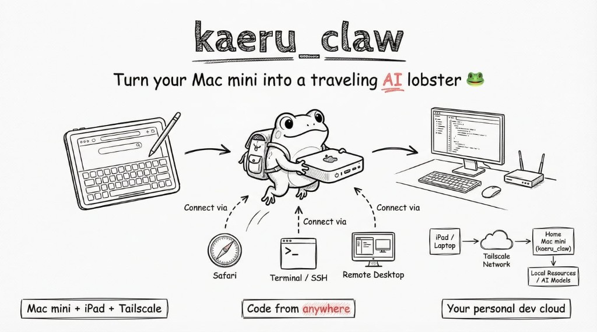

# 🦞 kaeru_claw

[中文](./README.zh-CN.md) | English

<p align="center">
  
</p>

**Turn your Mac mini into a traveling AI lobster — code from your iPad, anywhere.**

> kaeru（かえる）is a tribute to the hit game *Travel Frog* — this time, the lobster hits the road.

Your Mac mini sits at home, always on. Your iPad connects back through a Tailscale encrypted tunnel from anywhere — write code, run AI, preview your work. Perfect for sneaking in some personal dev time at the office: all traffic flows through Tailscale's private network, completely bypassing your company's internal network and any security monitoring.

---

## What Is This

A set of ready-to-use scripts and guides to build a secure remote dev environment with **Mac mini + iPad Air + Tailscale**.

```
iPad Air (any network)                    Mac mini (home)
  ┌─────────────┐    Tailscale tunnel     ┌──────────────┐
  │ Safari      │◄══════════════════════►│ Dev server    │
  │ Termius SSH │◄══════════════════════►│ Terminal      │
  │ RustDesk    │◄══════════════════════►│ Remote desktop│
  └─────────────┘                        └──────────────┘
       100.x.x.x  ◄── private net ──►  100.x.x.x
```

**Three access methods, all work simultaneously:**

| Purpose | iPad App | Connection |
|---------|----------|------------|
| Preview web UI | Safari | `http://<Mac-IP>:port` |
| Run commands / AI CLI | Termius | SSH to Mac mini |
| Full GUI access | RustDesk | Remote desktop |

---

## Quick Start

### Mac mini (5 min)

```bash
# 1. Download the script
curl -fsSL https://raw.githubusercontent.com/fatmind/kaeru_claw/main/setup-mac.sh -o setup-mac.sh

# 2. One-click setup
chmod +x setup-mac.sh && sudo ./setup-mac.sh

# 3. Verify
curl -fsSL https://raw.githubusercontent.com/fatmind/kaeru_claw/main/check.sh -o check.sh
chmod +x check.sh && ./check.sh
```

The script automatically:
- ✅ Installs Tailscale & RustDesk (via Homebrew)
- ✅ Configures "never sleep" + auto-restart after power loss + wake on LAN
- ✅ Enables SSH remote login
- ✅ Adds login items (Tailscale, RustDesk auto-start on boot)
- ✅ Configures Homebrew mirrors + proxy helpers (mainland China users)

### iPad Air (3 min)

Manual setup, very few steps → [iPad Setup Guide](./ipad-guide.md)

Install 3 apps:
1. **Tailscale** — encrypted tunnel
2. **Termius** — SSH terminal
3. **RustDesk** — remote desktop (optional)

> ⚠️ China mainland users: Tailscale and RustDesk may not be available on the China App Store. You'll need a **US Apple ID**. See the [iPad Setup Guide](./ipad-guide.md).

---

## Software Stack

| Software | Purpose | Mac mini | iPad |
|----------|---------|----------|------|
| [Tailscale](https://tailscale.com) | Private network tunnel | brew install | App Store |
| [RustDesk](https://rustdesk.com) | Remote desktop | brew install | App Store |
| [Termius](https://termius.com) | SSH client | — | App Store |

---

## Health Check

Run the diagnostic script anytime:

```bash
./check.sh
```

Example output:

```
🦞 kaeru_claw health check
━━━━━━━━━━━━━━━━━━━━━━━━━━
✅ Tailscale installed and running
✅ SSH remote login enabled
✅ Sleep disabled (sleep=0)
✅ Auto-restart after power loss enabled
⚠️  RustDesk not running (optional)
━━━━━━━━━━━━━━━━━━━━━━━━━━
```

---

## FAQ

<details>
<summary><b>Can't access Mac mini from iPad?</b></summary>

Troubleshoot in order:
1. Is Tailscale showing "Connected" on iPad?
2. Is your Mac mini showing a green dot (online)?
3. Can you `ping <Mac-Tailscale-IP>`?
4. Is your dev server listening on `0.0.0.0`? (not `127.0.0.1`)

Dev server must bind to `0.0.0.0`:
```bash
# Next.js
npm run dev -- -H 0.0.0.0
# Vite
npm run dev -- --host 0.0.0.0
# Python
python3 -m http.server 3000 --bind 0.0.0.0
```
</details>

<details>
<summary><b>SSH connection refused?</b></summary>

```bash
# Check if SSH is enabled on Mac mini
nc -z localhost 22 && echo "SSH OK" || echo "SSH not enabled"
# If not: System Settings → General → Sharing → Remote Login
```
</details>

<details>
<summary><b>Tailscale conflicts with proxy VPN?</b></summary>

If your proxy tool uses TUN/virtual NIC mode, it will conflict with Tailscale (both grab the virtual NIC).

Fix: Switch your proxy tool to "System Proxy" mode (disable TUN), keep Tailscale on. Use `proxy_on` for CLI tools.

iPad (iOS allows only one VPN at a time): Switch to Tailscale when you need remote access, switch back to proxy when you don't.
</details>

<details>
<summary><b>Website loading very slowly (>500ms)?</b></summary>

Might be going through Tailscale relay instead of direct connection:
```bash
tailscale status  # Check if peer is "direct" or "relay"
```
If relay: restart Tailscale on both devices to trigger re-holepunching.
</details>

<details>
<summary><b>Will my Tailscale IP change?</b></summary>

No. The 100.x.x.x IP is permanently assigned unless you remove the device and re-register. You can also use the device name instead of IP (requires MagicDNS): `http://your-mac-mini:3000`
</details>

---

## Power Recovery Chain

After setup, the Mac mini auto-recovers from power outages:

```
Power loss → Power restored → Auto boot → Auto login → Tailscale + RustDesk auto-start → Remote ready
```

The only manual step: start your dev server (since each project is different).

---

## China Mainland Users: Proxy & VPN Guide

If you're in China and need a proxy/VPN alongside Tailscale, check out our dedicated guide:

**→ [Proxy & VPN Guide](./proxy-guide.md)** — recommended airport (JMS), proxy clients for Mac/iPad/Android, and how TUN mode works with Tailscale.

---

## Credits

- [Tailscale](https://tailscale.com) — Making networking stupidly simple
- [RustDesk](https://rustdesk.com) — Open-source remote desktop
- [Termius](https://termius.com) — Beautiful mobile SSH client
- [Travel Frog](https://en.wikipedia.org/wiki/Tabikaeru) — The frog that started it all

## License

[MIT](./LICENSE)
