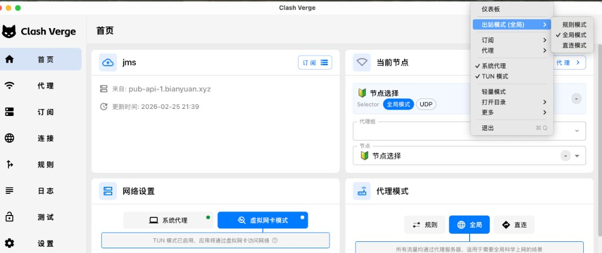

# 代理 & 翻墙指南（大陆用户）

[English](./proxy-guide.md) | 中文

> 如果你在海外，不需要看这篇 — Tailscale 开箱即用。
>
> 本指南面向中国大陆开发者，解决翻墙访问国际服务（GitHub、npm、AI API 等）和 Tailscale 远程访问共存的问题。

---

## 推荐机场

| 项目 | 详情 |
|------|------|
| 服务商 | **JustMySocks (JMS)** |
| 注册地址 | [justmysocks3.net/members](https://justmysocks3.net/members/) |
| 协议 | Shadowsocks / V2Ray |
| 为什么选 JMS | 搬瓦工旗下，IP 稳定，被封后自动轮换 |

订阅后会得到一个订阅链接，导入到代理客户端即可。

---

## 推荐代理客户端

| 平台 | 客户端 | 下载 |
|------|--------|------|
| **macOS** | Clash Verge Rev | [GitHub Releases](https://github.com/clash-verge-rev/clash-verge-rev/releases) |
| **iPad / iPhone** | Karing | [GitHub](https://github.com/KaringX/karing) / App Store（需美区账号） |
| **Android** | Clash Meta for Android | [clashmetaforandroid.com](https://clashmetaforandroid.com/) |

---

## Mac 上的 Clash Verge：TUN 模式详解

### 核心结论

**CLI 命令（npm、git、curl、brew 等）要走代理，必须开 TUN 模式（虚拟网卡），光开"系统代理"不够。**

原因：大部分 CLI 工具不读 macOS 的系统代理设置。TUN 模式在操作系统网络层拦截所有流量，CLI 工具无需任何额外配置就能自动走代理。

### Clash Verge 设置组合速查



| 场景 | 网络设置 | 代理模式 | 说明 |
|------|---------|---------|------|
| 在家，CLI 需要翻墙 | **虚拟网卡模式（TUN）** | **全局模式** | 所有流量走代理，最省心 |
| 在家，CLI 需要翻墙（省流量） | **虚拟网卡模式（TUN）** | **规则模式** | 只代理匹配规则的流量，国内直连 |
| 外出，需要 Tailscale 远程访问 | **系统代理**（关闭 TUN） | 规则/全局 | TUN 和 Tailscale 都用虚拟网卡，会冲突 |

### 重要：TUN 模式与 Tailscale 不能同时开

两者都创建虚拟网卡接管网络路由，同时开可能导致：
- Tailscale 隧道不通
- DNS 解析异常
- 部分流量走错通道

**切换口诀：在家开 TUN，出门关 TUN 开 Tailscale。**

---

## 全景图

```
┌─────────────────────────────────────────────────┐
│                 在家                              │
│                                                  │
│  Clash Verge (TUN 模式) ── 代理 ──► 国际网络     │
│  Tailscale: 关闭                                 │
│                                                  │
│  CLI 工具 (npm/git/curl) 通过 TUN 自动走代理      │
└─────────────────────────────────────────────────┘

┌─────────────────────────────────────────────────┐
│                 外出（公司 / 咖啡馆）               │
│                                                  │
│  Clash Verge (系统代理模式，关闭 TUN)              │
│  Tailscale: 开启 ── 隧道 ──► 家里的 Mac mini     │
│                                                  │
│  CLI 工具用 proxy_on / proxy_off 快捷命令走代理    │
└─────────────────────────────────────────────────┘
```

---

## 相关文档

- [项目主页](./README.zh-CN.md) — 项目介绍和快速开始
- [iPad 配置指南](./ipad-guide.zh-CN.md) — iPad 端配置步骤
